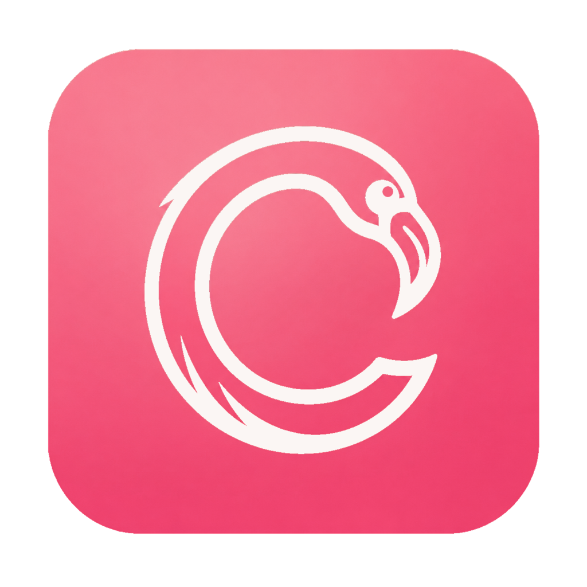
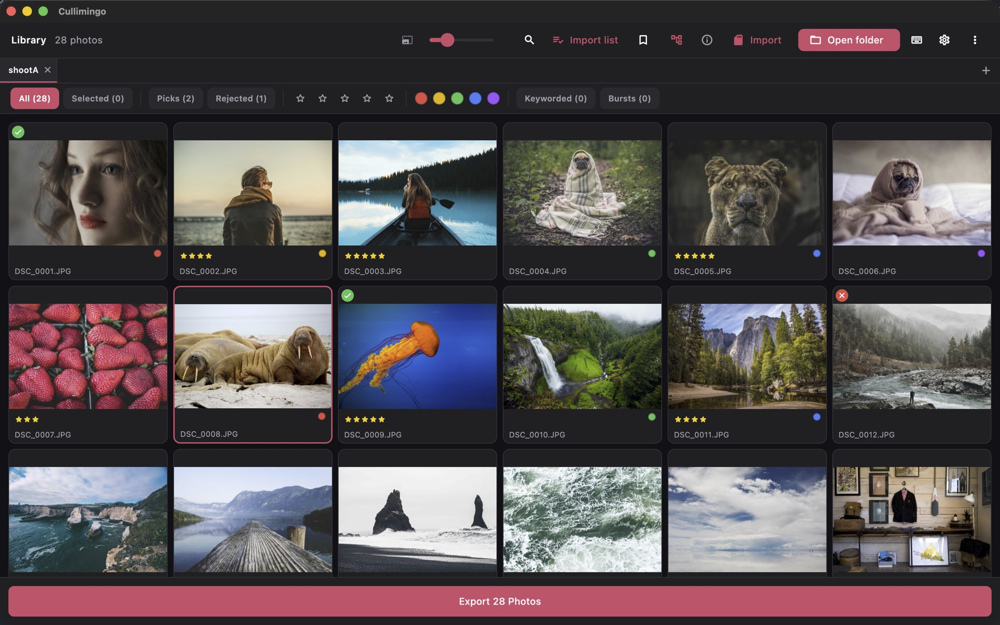

<p align="center">
  
</p>

<h1 align="center">Cullimingo</h1>

<p align="center">
  A fast, open-source, cross-platform <b>photo-culling</b> app for professional
  workflows.<br>
  <b>Ingest → cull → filter → export → hand off.</b> Speed is the product. 🦩
</p>

<p align="center">
  
  
  
  
</p>

<p align="center">
  <a href="https://github.com/nielsfranke/Cullimingo/wiki"><b>User guide</b></a> ·
  <a href="https://github.com/nielsfranke/Cullimingo/wiki/Keyboard">Keyboard</a> ·
  <a href="https://github.com/nielsfranke/Cullimingo/wiki/Screenshots">Screenshots</a> ·
  <a href="ARCHITECTURE.md">Architecture</a> ·
  <a href="BUILD_PLAN.md">Build plan</a> ·
  <a href="LICENSE">License</a>
</p>

A flamingo is nature's culler: a *filter feeder* that pumps in huge volumes,
ejects the water and mud, and keeps only what's worth keeping. That's the job —
get through thousands of frames and keep the keepers, fast.

<p align="center">
  <a href="https://github.com/nielsfranke/Cullimingo/wiki/Screenshots">
    
  </a>
</p>
<p align="center"><sub>Rating, flagging and colouring a shoot in the grid · <a href="https://github.com/nielsfranke/Cullimingo/wiki/Screenshots">more screenshots →</a> · placeholder photos via <a href="https://picsum.photos/">Lorem Picsum</a> (Unsplash; see <a href="docs/screenshots/CREDITS.md">credits</a>)</sub></p>

## About

I built Cullimingo for myself — a fast, keyboard-first way to get through
thousands of frames and keep the keepers, without a subscription or a
heavyweight forever-catalog. There's plenty of paid culling software but little
that's open-source and self-owned, so I made my own. I'm not a professional
developer and much of it was built with AI assistance
([Claude Code](https://claude.com/claude-code)) under my direction, so expect
the odd rough edge — [bug reports](https://github.com/nielsfranke/Cullimingo/issues)
are very welcome.

## Download

Grab the latest build from the
[**Releases**](https://github.com/nielsfranke/Cullimingo/releases/latest) page.

- **Linux** — download the `.AppImage`, make it executable, and run it:
  ```sh
  chmod +x Cullimingo-x86_64.AppImage
  ./Cullimingo-x86_64.AppImage
  ```
- **macOS (Apple Silicon)** — open the `.dmg`, drag **Cullimingo** to
  **Applications**, then clear the quarantine flag once (it's unsigned):
  ```sh
  xattr -cr /Applications/Cullimingo.app
  ```

Both builds are self-contained — no Homebrew or apt libraries needed — but
unsigned. See [DISTRIBUTION.md](DISTRIBUTION.md) for the details.

## What it does

- **Cull at speed** — open a folder of RAWs/JPEGs → virtualized, dense dark grid
  → keyboard rate / flag / colour that persists instantly. Multi-select
  + batch marking, right-click palette, tabs for multiple folders.
- **Loupe & compare** — full-screen loupe (zoom/pan, neighbour prefetch) and a
  2-up / n-up compare view, both keyboard-cullable.
- **Real filtering & selections** — quick-filter bar (rating / flag / colour /
  keyworded / selected, live counts), saved named selections, and ⌘F find by a
  pasted filename list. Import a Picdrop/CSV list to select the matching RAWs.
- **Ingest** — verified (SHA-256) card import with a token-based rename template,
  dual-destination, throughput readout, and auto card-detect.
- **Metadata & interop** — XMP sidecars round-trip rating + colour + keywords
  with Capture One and Lightroom (read embedded XMP too); pick/reject lives in a
  private `cullimingo:` namespace. Re-sync adopts external edits, flags conflicts.
- **Captioning for journalists** — a full IPTC Core editor (single photo or
  batch), saved metadata templates with named snapshots and apply-on-ingest,
  `=code=` replacements and multi-field "hot codes",
  IPTC Subject Code / Media Topics, and offline GPS→city reverse geocoding.
  Exports embed IPTC as both XMP and legacy IIM.
- **Export** — non-modal background export (bounded-concurrency isolate pool):
  resize / quality / sharpen / rename template / size cap, keep culling while it
  runs. RAW exports use the embedded preview.
- **Hand-off** — drag originals straight to Finder, verified copy / move the
  selection (with XMP sidecars) to any folder, send it to your own editors
  (Capture One / Lightroom / Photoshop / GIMP / …) via the right-click menu or
  ⌘E, wire it straight to an agency over FTP / FTPS / SFTP, or send to / pull
  client ratings back from a
  [ContactSheet](https://github.com/nielsfranke/contactsheet) gallery.
- **Polish** — metadata inspector, burst & duplicate grouping (+ perceptual-hash
  "find similar"), RAW+JPEG pairing, configurable shortcuts, performance presets,
  in-app log viewer, reopen-last-folders.

RAW preview extraction is C/C++ FFI via **LibRaw** (no Rust); thumbnails decode
and resize off the UI isolate through **libvips**. The UI isolate never blocks.

Cullimingo is **not** a RAW developer, not a forever catalog, and **no AI
culling** in v1 — see [`BUILD_PLAN.md`](BUILD_PLAN.md) for the non-goals. Video
is culled by its poster frame; playback hands off to your **system player**
(no in-app playback).

## Keyboard

| Keys | Action |
| --- | --- |
| arrows | navigate the grid |
| `1`–`5` | rate · `0` / `Delete` clears |
| `P` / `X` | pick / reject |
| `6 7 8 9` | colour: red / yellow / green / blue · `Backspace` purple |
| `Space` | select · ⌘/Ctrl-click toggle · Shift-click range |
| `Enter` / `F` | loupe · `C` compare · `B` burst |
| `I` | metadata inspector · `K` keywords |
| ⌘/Ctrl `O` `T` `W` `A` `F` `S` `E` `R` | open · new tab · close tab · select all · find · export · send to primary editor · refresh |
| `?` | shortcuts cheat sheet (rebindable in Settings) |

**Instantly familiar** — the defaults follow the de-facto culling keys
(`1`–`5` rate, `0` clears, `P`/`X` pick/reject, `6`–`9` colours). No new
muscle memory to learn, and every key is rebindable in Settings.

Full list: [**Keyboard** on the wiki](https://github.com/nielsfranke/Cullimingo/wiki/Keyboard).

## Documentation

| | |
|---|---|
| 📖 **[User guide](https://github.com/nielsfranke/Cullimingo/wiki)** | What Cullimingo does and how to cull with it |
| ⌨️ **[Keyboard](https://github.com/nielsfranke/Cullimingo/wiki/Keyboard)** | The full keyboard map |
| 🖼️ **[Screenshots](https://github.com/nielsfranke/Cullimingo/wiki/Screenshots)** | Grid, loupe, compare and the inspector |
| 🛠️ **[Development](https://github.com/nielsfranke/Cullimingo/wiki/Development)** | Set up, run and build from source |
| 🎞️ **[RAW & interop](https://github.com/nielsfranke/Cullimingo/wiki/RAW-and-Interop)** | LibRaw, libvips, XMP round-trip with C1 / Lightroom |
| ✍️ **[Captioning & delivery](https://github.com/nielsfranke/Cullimingo/wiki/Captioning-and-Delivery)** | IPTC templates, hot codes, reverse geocoding, FTP/FTPS/SFTP wire transmission |
| 🏗️ **[Architecture](ARCHITECTURE.md)** | Layers, isolates, cache — the technical map |
| 🗺️ **[Build plan](BUILD_PLAN.md)** | Phased plan, locked stack and rationale |

## Develop

```bash
flutter pub get
dart run build_runner watch --delete-conflicting-outputs   # keep running
flutter run -d macos      # or: flutter run -d linux
```

macOS needs Xcode + CocoaPods; both platforms need LibRaw and libvips for
RAW/thumbnail decode (`brew install libraw vips`, or the distro `-dev` packages).
Full setup and the pre-commit checks are in
[**Development**](https://github.com/nielsfranke/Cullimingo/wiki/Development).

## Support

Cullimingo is free, open-source, and built in my spare time. If it saves you
time on a shoot and you'd like to help keep it going, you can buy me a coffee —
every bit is appreciated. ☕

[](https://ko-fi.com/nielsfranke)

## License

[GNU AGPL-3.0-or-later](LICENSE). Cullimingo is free software — use, modify, and
self-host it freely. If you distribute a modified version, you must release your
changes under the same license and make the corresponding source available.

Contributions are welcome under a simple
[Contributor License Agreement](CLA.md).

Reverse geocoding uses place data from [GeoNames](https://www.geonames.org)
([CC BY 4.0](https://creativecommons.org/licenses/by/4.0/)), bundled as
`assets/geo/cities.tsv.gz` (regenerate with `tool/build_gazetteer.sh`).

The Media-Topics autocomplete uses the [IPTC Media Topics
NewsCodes](https://cv.iptc.org/newscodes/mediatopic/) ([CC BY
4.0](https://creativecommons.org/licenses/by/4.0/), © IPTC), bundled as
`assets/iptc/mediatopics.tsv.gz` (regenerate with
`tool/build_media_topics.sh`).
